-----------------------------------------------------------------------
# REPOSITORIO DE LA API TAREA 1 PARTE DOS
-----------------------------------------------------------------------

Este repositorio contiene una API de prueba que permite LA BUSQUEDA DE INDICADORES DE COMPROMISO (IOC). El repositorio esta dividido en dos ramas una main principal y una segunda rama llamda **feature/domain-lookup**

-----------------------------------------------------------------------
# PRUEBA LOCAL DE LA API
-----------------------------------------------------------------------
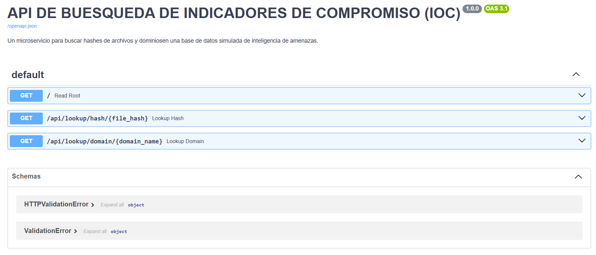

-----------------------------------------------------------------------
# primera prueba se envia la petición a la API MEDIANTE EL CODIGO
-----------------------------------------------------------------------
curl http://localhost:8000/api/lookup/hash/275a021bbfb6489e54d471899f7db9d1663fc695ec2fe2a2c4538aabf651fd0f

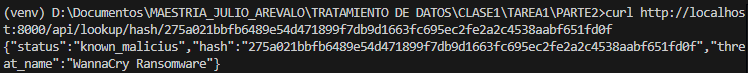
-----------------------------------------------------------------------
-----------------------------------------------------------------------
# PRUEBA DE HASH LIMPIO

curl http://localhost:8000/api/lookup/hash/estoesunhashlimpio123456

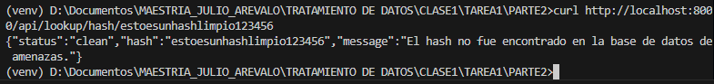
-----------------------------------------------------------------------
-----------------------------------------------------------------------
# PRUEBA DE DOMINIO MALICIOSO

curl http://localhost:8000/api/lookup/domain/evil-updates.net

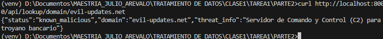
-----------------------------------------------------------------------
-----------------------------------------------------------------------
# PRUEBA DE DOMINIO LIMPIO
curl http://localhost:8000/api/lookup/domain/google.com
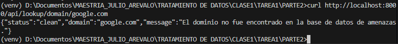
-----------------------------------------------------------------------
-----------------------------------------------------------------------
# Respuestas del Servicio
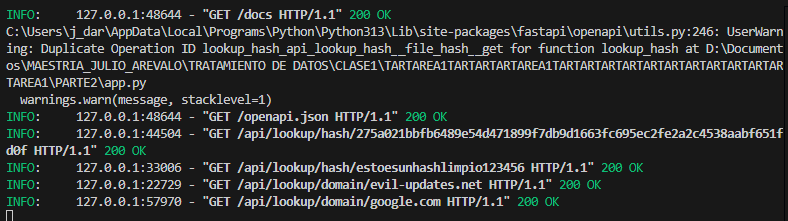
-----------------------------------------------------------------------
-----------------------------------------------------------------------
# Construyendo Docker

docker build -t ioc-lookup-api:1.0 . 
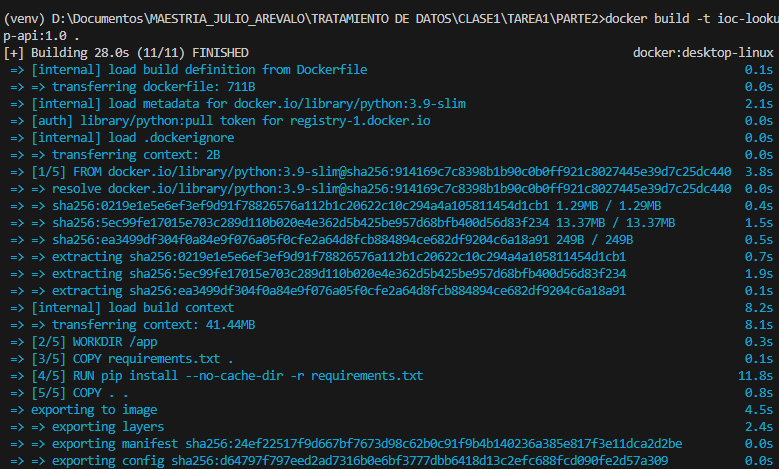
-----------------------------------------------------------------------
-----------------------------------------------------------------------
# Verificar la creación de la imagen
docker images

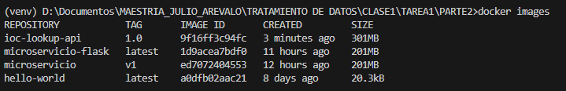
-----------------------------------------------------------------------
-----------------------------------------------------------------------
# Ejecutar el contenedor 
docker run -d -p 8000:8000 --name mi-api-ioc ioc-lookup-api:1.0

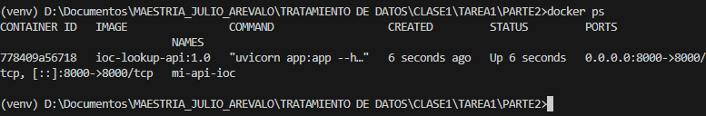
-----------------------------------------------------------------------
-----------------------------------------------------------------------
# Prueba Docker 

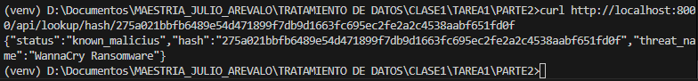
-----------------------------------------------------------------------
-----------------------------------------------------------------------
# Docker Logs

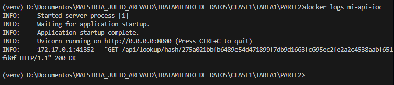
-----------------------------------------------------------------------