-----------------------------------------------------------------------
# REPOSITORIO DE LA API TAREA 1 PARTE DOS
-----------------------------------------------------------------------

-----------------------------------------------------------------------
### INTRODUCCIÓN
-----------------------------------------------------------------------
Este repositorio contiene el codigo fuente de una API RESRful de prueba que permite LA BUSQUEDA DE INDICADORES DE COMPROMISO (IOC). Esta API simula un microservicio de inteligencia de amenazas, permitiendo consultar a los ususarios si un  de archivo o un nombre de *Dominio* son conocidos por ser maliciosos.

------------------------------------------------------------------------
------------------------------------------------------------------------
### FUNCIÓN PRINCIPAL
------------------------------------------------------------------------
La **API** funciona utilizando una simulacion de base de datos en memoria, en la cual se utiliza un diccionario de python donde se contiene todas las amenzas predefinidas. Cada endpoints disponibles permiten realizar una busqueda individual de la información comparando los datos proporcionados  contra la base de datos simulada para determinar si un indicador es malicioso.

El desarrollo se ha gestionado siguiendo un flujo de trabajo en ramas:
**main**: Contiene la version estable de la  incluyendo elendpoint principalpara la busqueda de *hashes* 
**feature/domain-lookup**: Es una rama de funcionalidad donde se desarrolló y probó de forma aislada el endpoint para la busqueda de dominios.

-------------------------------------------------------------------------

-------------------------------------------------------------------------
# PRUEBA LOCAL DE LA API
-----------------------------------------------------------------------
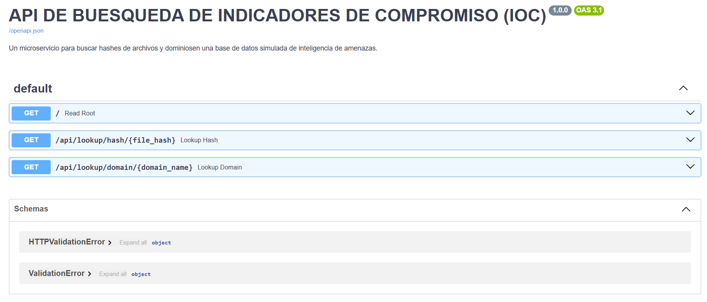

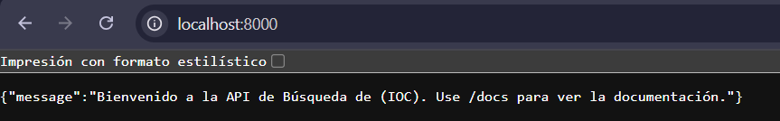
-----------------------------------------------------------------------
# primera prueba se envia la petición a la API MEDIANTE EL CODIGO
-----------------------------------------------------------------------
curl http://localhost:8000/api/lookup/hash/275a021bbfb6489e54d471899f7db9d1663fc695ec2fe2a2c4538aabf651fd0f

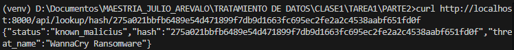
-----------------------------------------------------------------------
-----------------------------------------------------------------------
# PRUEBA DE HASH LIMPIO

curl http://localhost:8000/api/lookup/hash/estoesunhashlimpio123456

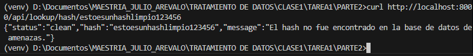
-----------------------------------------------------------------------
-----------------------------------------------------------------------
# PRUEBA DE DOMINIO MALICIOSO

curl http://localhost:8000/api/lookup/domain/evil-updates.net

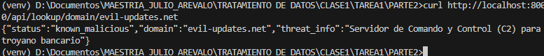
-----------------------------------------------------------------------
-----------------------------------------------------------------------
# PRUEBA DE DOMINIO LIMPIO
curl http://localhost:8000/api/lookup/domain/google.com
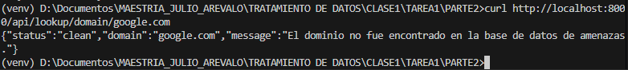
-----------------------------------------------------------------------
-----------------------------------------------------------------------
# Respuestas del Servicio
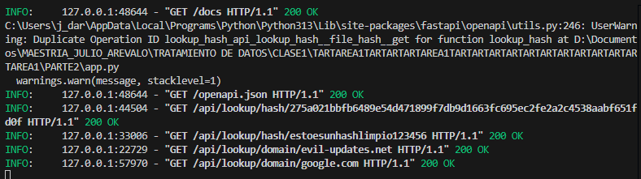
-----------------------------------------------------------------------

-----------------------------------------------------------------------
# Construyendo Docker
-----------------------------------------------------------------------

docker build -t ioc-lookup-api:1.0 . 
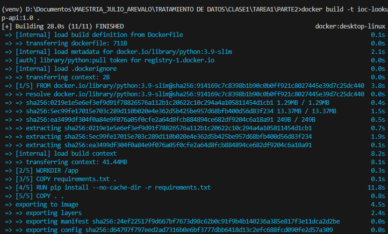

-----------------------------------------------------------------------

-----------------------------------------------------------------------
# Verificar la creación de la imagen
docker images

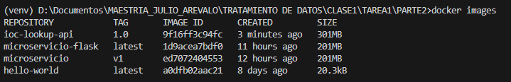
-----------------------------------------------------------------------
-----------------------------------------------------------------------
# Ejecutar el contenedor 
-----------------------------------------------------------------------
docker run -d -p 8000:8000 --name mi-api-ioc ioc-lookup-api:1.0

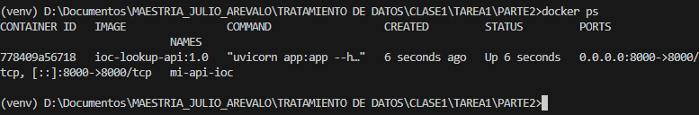
-----------------------------------------------------------------------
-----------------------------------------------------------------------
# Prueba Docker 

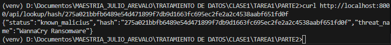
-----------------------------------------------------------------------
-----------------------------------------------------------------------
# Docker Logs

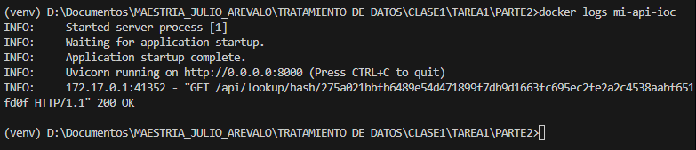
-----------------------------------------------------------------------